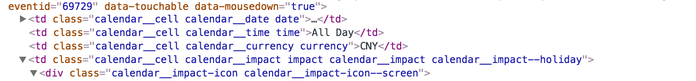

```{r setup, include=FALSE}
knitr::opts_chunk$set(
	echo = TRUE, #If TRUE show code on the document
	message = FALSE,
	warning = FALSE, 
	fig.align = "center"
)

library(fImport)  # Download data from de FRED
library(rvest)    # Scrapping data
library(stringr)  # Manipulate strings
library(ggplot2)  # Draw nice plots
library(xts)      # Handle Time Series
library(dplyr)    # Manipulate data frames
setwd("~/Documents/R_Projects/Master/GIE/WebScrapping/Project")
```

\centering
\raggedright
\newpage
\tableofcontents
\newpage

# Introducción

## Motivación

El objetivo del proyecto es ser capaces de descarganos los datos del calendario macro economico de la página http://www.forexfactory.com/calendar. Algunos de los datos que nos podremos decargar estan publicados en las páginas web oficiales de cada país. Recolectar todos estos datos puede ser una tarea dura debido a que cada país tiene su propio formato, los datos no están organizados, etc. Es por esto, que nos será de gran utilidad ser capaces de tener todos los datos de una vez y posteriormente poder aplicarnos en nuestros análisis macro económicos.

## Estructura de los datos

A continuación se muestra el formato del calendario de la página de Forexfactory. El calendario está dividido en varias columnas:

* Día
* Hora de la noticia / evento.
* Moneda a la que afectará el evento.
* Impacto: Se muestran de color amarillo aquellas noticias que son de poca relevancia, de color naranja aquellas que pueden tener un impacto medio y, finalmente, de color rojo aquellas que tienen un impacto importante.
* Breve descripción del tipo de noticia / comunicado.
* En la carpeta tenemos un enlace en el que tendremos algo más de información.
* Actual: Se muestra el valor de dato que se va a comunicar en el evento.
* Forecast: Previsión del dato que tiene que salir.
* Previous: Valor que tenía previamente el indicador en cuestión.

{ width=600px height=300px }

Si nos fijamos en la parte superior izquierda podemos ver el enlace **Next**. Este enlace nos lleva a la siguiente semana, por lo tanto para obtener los datos de diferentes días tendremos que ir de una página a la siguiente.

Además, si clicamos encima de la carpeta podemos obtener información detallada sobre el evento. Por ejemplo:

* Fuente de datos
* Explicación del evento
* Cómo suele afectar a las divisas que están relacionadas, es decir si el datos es positivo afecta bien o mal.
* Motivos por los que los especuladores (inversores) tienen en cuenta esta noticia.

{ width=600px height=300px }

# Accediendo a los datos

Para poder acceder a los datos lo primero que tenemos que hacer es copiar la URL de un dia en concreto y descarnos la página web con la funcion *read_html*. Una vez tengamos los datos accederemos a la tabla *.calendar_row* y lo guardaremos en la variable *web_selected*, que será una lista con todos los elementos.
```{r}
url <- "https://www.forexfactory.com/calendar.php?day=may2.2017"
web_full <- read_html(url)
web_selected <- web_full %>% html_nodes("table .calendar_row")
```

Ahora que ya tenemos seleccionada la tabla general del calendario, tenemos que acceder a cada uno de los datos que nos interesa. Por ejemplo si queremos extraer la fecha accederemos indicando que en la primera posicion de la lista *web_selected* seleccionaremos el nodo que tiene un tabla con la clase *.date*. Del mismo modo si queremos extraer la moneda que estará afectada le indicaremos que tiene que seleccionar el valor del nodo donde la clase sea *.currency*.

En el caso de los campos numéricos, como pueden ser *Actual*, *Forecast* y *Previous* se aplica una reestricción para descartar carácteres que no nos interesan y quedarnos solamente con los números:

```{r Solo seleccion numeros, eval=F, echo=T}
gsub("[^0-9&.-]", "", .)
```

y en el caso de los campos de texto eliminaremos los espacios extra del inicio y final de las frases:
```{r trimws, eval=F, echo=T}
trimws()
```

{ width=600px }

```{r}
dates <- web_selected[1] %>%
    html_nodes("td .date") %>%
    html_text()

currency <- web_selected[1] %>% 
  html_nodes(".currency") %>%
  html_text() %>%
  trimws() %>%
  as.character()

actual_value <- web_selected[1] %>%
    html_nodes(".actual") %>%
    html_text() %>%
    gsub("[^0-9&.-]", "", .) %>%
    as.numeric()

data.frame("Date" = dates, "Currency" = currency, "Actual" = actual_value)
```



## Extracción de los datos de toda la semana
Una vez tenemos todos los datos que queremos seleccionar crearemos una función para que el código sea más flexible.

```{r}
extract_data_of_day <- function(current_day) {
  
  dates <- current_day %>%
    html_nodes("td .date") %>%
    html_text()
  
  currency <- current_day %>% 
    html_nodes(".currency") %>%
    html_text() %>%
    trimws() %>%
    as.character()
  
  impact <- current_day %>%
    html_nodes(".impact span") %>%
    html_attr("class") %>%
    trimws()
  
  event_name <- current_day %>%
    html_nodes(".event span") %>%
    html_text() %>%
    trimws()

  actual_value <- current_day %>%
    html_nodes(".actual") %>%
    html_text() %>%
    gsub("[^0-9&.-]", "", .) %>%
    as.numeric()
  
  forecast_value <- current_day %>%
    html_nodes(".forecast") %>%
    html_text() %>%
    gsub("[^0-9&.-]", "", .) %>%
    as.numeric()
  
  previous_value <- current_day %>%
    html_nodes(".previous") %>%
    html_text() %>%
    gsub("[^0-9&.-]", "", .) %>%
    as.numeric()
  
  res <- data.frame(
    "Currency" = currency,
    "Impact" = ifelse(length(impact) == 0, NA, as.character(impact)),
    "Event" = event_name,
    "Actual" = actual_value,
    "Forecast" = forecast_value,
    "Previous" = previous_value
  )
  return(res)
}

# Test Function
extract_data_of_day(web_selected) %>% cbind(date = "2017-05-02", .) %>% head(6)
```

Con la función *extract_data_of_day* obtenemos toda la información de un día del calendario, pero qué pasa si queremos sacar la de todos los días de la semana que tenemos cargada? Para ello tenemos que iterar sobre cada uno de los días. Lo haremos con la siguiente línea de código:

```{r}
web_filtered <- lapply(web_selected, extract_data_of_day) %>% bind_rows()
web_filtered %>% head()
```

## Extracción de los datos de múltiples fechas
Hasta ahora hemos podido extraer toda la información de la semana que teníamos cargada en el navegador, pero nosotros lo que queremos es extraer todo el histórico de datos. Para ello tenemos que extraer los datos de todas las semanas anteriores y unirlos.

Si nos fijamos, la dirección URL está formada de la siguiente manera: http://www.forexfactory.com/calendar.php?day=may2.2017. Lo que nos importa es **may2.2017**:

* may: Mes abreviado
* 2: día del mes
* 2017: Año

Sabiendo esto, podemos crear de forma automática las URL's de cada día y extraer los datos iterando sobre cada URL.

```{r, eval=FALSE}
day <- as.Date("2017-05-02")

# Creamos las abreviaciones de cada mes
months_abbrev <- c("jan", "feb", "mar", "apr", "may", "jun", 
                   "jul", "aug", "sep", "oct", "nov", "dec")

# Hacemos un split de la fecha en dia, mes y año
day_of_month <- format(day, "%d") %>% as.integer()
number_of_month <- format(day,"%m") %>% as.integer()
number_of_month <- months_abbrev[number_of_month]
year <- format(as.Date(day), "%Y") %>% as.integer()

# Contruimos la URL del dia seleccionado
url <- paste0("http://www.forexfactory.com/calendar.php?day=", 
              number_of_month, day_of_month, ".", year)

# Descargamos los datos
web_full <- read_html(url)

# Seleccionamos la tabla principal
web_selected <- web_full %>% html_nodes("table .calendar_row")
```

Ahora solo tendríamos que llamar a la funcion *extract_data_of_day* (con argumento *web_selected*) para extraer los datos del día seleccionado, tal y como hemos hecho anteriormente.

Igual que en el paso anterior crearemos una función para que el código sea más flexible y modular. La función solo tiene un argumento *range_dates*, un vector con las fechas que queremos extraer la información

```{r}
get_macro_data <- function(range_dates) {
    
  # Lista para guardar la informacion de cada dia
  dataset <- list()
  
  # Interamos sobre cada dia del vector de fechas
  for (day in range_dates) {
    day <- as.Date(day)
    cat("Downloading:", format(day, "%Y-%m-%d"), "\n")
    
    # Hacemos un split de la fecha en dia, mes y año
    day_of_month <- format(day, "%d") %>% as.integer()
    number_of_month <- format(day,"%m") %>% as.integer()
    number_of_month <- months_abbrev[number_of_month]
    year <- format(as.Date(day), "%Y") %>% as.integer()
    
    # Contruimos la URL. 
    # Ejemplo: http://www.forexfactory.com/calendar.php?day=jan1.2007
    url <- paste0("http://www.forexfactory.com/calendar.php?day=", 
                  number_of_month, day_of_month, ".", year)
    web_full <- read_html(url)
    web_selected <- web_full %>% html_nodes("table .calendar_row")
    
    # Seleccionamos la informacion
    web_filtered <- 
      web_selected %>% 
      lapply(extract_data_of_day) %>% 
      bind_rows() %>% 
      cbind(date = day, .)
    
    # Store all the data in a list
    dataset[[as.character(day)]] <- web_filtered
  }
  
  return(dataset)
}
```

## Unión de todo lo anterior: Ejemplo completo
Con las dos funciones creadas ya podemos contruir las líneas de código que nos haran de *main*. En primer lugar indicamos la fecha de inicio y fin, y creamos la secuencia de fechas. Después definimos todos los meses abreviados con el formato que utiliza la fecha, aunque también se puede utilizar la función *month* del paquete *lubridate*, tal y como se muestra en los comentarios.

Finalmente llamamos a la funcion *get_macro_data*

```{r Main Function, }
# Define start and end dates
start_date <- as.Date("2017-05-28")
end_date   <- as.Date("2017-05-29")
range_dates <- seq(from = start_date, to = end_date, by = "1 day")

# Creamos las abreviaciones de cada mes
months_abbrev <- c("jan", "feb", "mar", "apr", "may", "jun", 
                   "jul", "aug", "sep", "oct", "nov", "dec")

# Tambien podemos crearlo utilizando la function 'month' de la libreria lubridate
# months_abbrev <- lubridate::month(1:12, label = T)

# Run the script
t_start <- Sys.time()
data_raw <- get_macro_data(range_dates) %>% 
  bind_rows() %>% filter(Currency != "") %>% 
  mutate(Currency = as.factor(Currency), Impact = as.factor(Impact))
#saveRDS(data_raw, "data_raw.rds")
Sys.time() - t_start
```

Vamos a comprobar que se hayan descargado los datos correctamente (las fechas no son las mismas que las que hemos indicado porque estamos cargando un fichero donde nos hemos descargado un rango más amplio)
```{r}
data_raw <- readRDS("data_raw.rds")
bind_rows(head(data_raw, 3), tail(data_raw, 3))
```


# Análisis de los datos

Con todos los datos descargados podemos hacer múltiples análisis, para empezar vamos a hacer un descriptivo de los datos para hacernos una idea principal de qué es lo que tenemos:

```{r}
ggplot(data_raw, aes(x = Currency, fill = Currency)) +
  geom_bar(stat = "count") +
  geom_text(stat = "count", aes(label = ..count..), vjust = -1) +
  ggtitle("Frecuencia de Eventos por divisa") + 
  xlab("Divisa") + ylab("Frecuencia") + 
  ylim(0, 420)
```

Claramente tenemos muchos más eventos para el Euro y para el Dólar que para el reto de divisas. Vamos a ver de qué tipo son:

```{r}
data_raw %>% filter(Currency %in% c("EUR", "USD") & Impact != "holiday") %>% 
ggplot(aes(x = Impact, fill = Impact)) +
  geom_bar(stat = "count") +
  geom_text(stat = "count", aes(label = ..count..), vjust = -1) +
  facet_wrap(~ Currency) + 
  ggtitle("Impacto de los eventos") + 
  xlab("Impacto") + ylab("Frecuencia") + 
  ylim(0, 220)
```

Podemos seleccionar aquellos que han salido más veces y vamos a crear un objeto de tipos *time series*.
```{r}
data_raw %>% 
  filter(Currency %in% c("EUR", "USD")) %>% 
  group_by(Currency, Event) %>% 
  summarise(n = n()) %>% 
  arrange(desc(n)) %>% 
  head(4)
```

Una vez tenemos los datos en formato time series podemos aplicar todos los análisis que hemos aprendido en otras asignaturas.
```{r}
COI <- data_raw %>% 
  filter(Event == "Crude Oil Inventories")

COI_Actual <- ts(COI$Actual, start = c(2017, 05), frequency = 52)
COI_Forecast <- ts(COI$Forecast, start = c(2017, 05), frequency = 52)

ts.plot(COI_Actual, COI_Forecast, col = 1:2)
legend("topright", c("CIO Actual", "COI Forecast"), col = 1:2, lty = 1, cex = 0.9)
```


