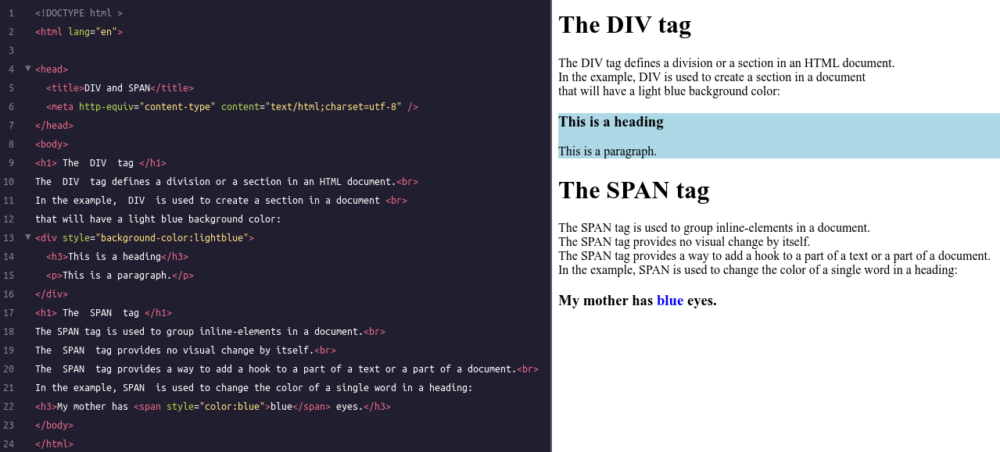
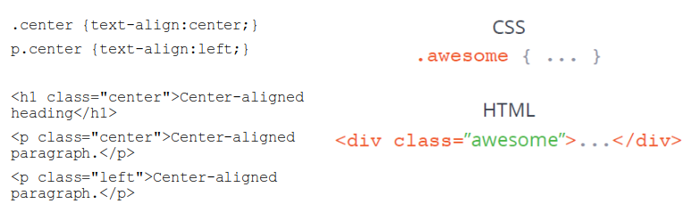

<style type="text/css">
.remark-slide-content {
    font-size: 28px;
    padding: 1em 2em 1em 2em;
}
.left-code {
  color: #777;
  width: 38%;
  height: 92%;
  float: left;
}
.right-plot {
  width: 60%;
  float: right;
  padding-left: 1%;
}
</style>

```{r setup, include=FALSE}
options(htmltools.dir.version = FALSE, echo=FALSE,
        message=FALSE,warning=FALSE,
        fig.dim=c(4.8, 4.5), fig.retina=2, out.width="100%")

knitr::opts_chunk$set(echo = FALSE)

knitr::knit_hooks$set(mysize = function(before, options, envir) {
  if (before) 
    return(options$size)
})
```


# Outline

.columnwide[
  ### 1) [Introduction to HTML](#Introduction)
  ### 2) [Site formatting with Cascading Style Sheets (CSS)](#CSS)
  ### 3) [References and Resources](#Resources)
]

---

class: inverse, middle, center

name: Introduction

# Introduction to HTML

---


# What is HTML

- HTML is a computer language devised to allow website creation. 
- It is relatively __easy to learn__, with the basics being accessible to most people in one sitting.
- It is quite __powerful__ in what it allows you to create,
- It is constantly undergoing revision and evolution
- The most recent incarnation is HTML5
    <!-- - Has many improvements but -->
    <!-- - Basic grammar has not changed and is still _one of the most important standards_ for working with and on the Web. -->

---

# General characteristics 

- HTML: HyperText Markup Language
- Based on "tags", like markdown or _latex_.
- Combines power & simplicity
  - HTML documentos are text (ASCII) files.
  - HTML is (intended to be) “portable”.
  - Can include links to (Hyper)text and (Hyper)media.


---

# HTML editors

- General purpose editors:
    - Emacs, Textpad, Notepad++
  
- Browser-related editors
  - Kompozer, 

- Specific editors
  - HoTMetaL, Quanta, Front Page
  
- Word processors 
  - __Avoid this option__

---

# HTML, CSS and javascript

```{r}

```

---
# HTML documents

- An HTML document is basically plain text that can be opened and edited with any text editor. 
- HTML’s power lies in its marked up structure. 
- HTML markup allows defining: 
  - the parts of a document that need to be displayed as headlines, - the parts that contain links, 
- the parts that should be organized as tables, 
- etc.

---

# HTML elements

- The building blocks of HTML documents are HTML elements.
- "Elements" are made of text (content) enclosed between two tags.
- "Tags" are pairs of words enclosing content.
  - Words are identical but closing tag starts by "/".
  
```{r}
knitr::include_graphics("images/htmlExample1.png")
```

---

# HTML Tags, Elements, Atributes

```{r}

```

---

# Attributes have names and values

- This is very relevant for web scraping because these are used to locate and select content.

```{r}

```

---

#  Minimal HTML Document Structure 


```{r}

```


- Any HTML document is enclosed by the HTML tags
- Two compulsory sections enclosed by HEAD and BODY tags.
- All other tags are optional and depend on the content.

---

#  Ordered and unordered lists

```{r, out.width="90%"}
knitr::include_graphics("images/htmlExample2.png")
```

<!-- .center[  -->
<!--   -->
<!-- ] -->

---

#  HTML Tables

```{r, out.width="90%"}
knitr::include_graphics("images/htmlExample4.png")
```

- Most common HTML data container in web sites
- Structure is very flexible and _hierarchichal_

---

# Hypertext and links

```{r, out.width="90%"}

```
- Hyperlinks allow linking any two pages independently of their physical location 
- Link may be to pages or to some elements of a given page.
- Elements in the same page can also be linked

---


# Images

```{r, out.width="90%"}

```
- HTML: text files, not admiting _copy and paste_ images.
- Images are inserted _(linked)_ from graphical files.

---
#  HTML grouping tags: DIV & SPAN 

```{r, out.width="99%"}

```

- DIV defines _block-level_ section  HTML elements container.
- SPAN defines  _inline_  sections: Text container.
- No required  attributes but may use  _style_ , _class_ or _id_.

---

# HTML cheatsheet

```{r, out.width="90%"}

```

---
# Exercise

- Select a topic you feel comfortable with.
- Write or get a text that is organized in, at least two or three sections. 
- Allow the code to have all the elements we have learnt about: text, tables, images, hyperlinks...
- __optional__ Organize it in linked sections 
  - Build a table of contents using an ordered list, where
  - each element links to each section's title.
  - Give each sections a title with headings of same type
  - Name each title to make it linkable.
  - End each section with a link to the table of contents followed by a horizontal bar.
---

class: inverse, middle, center

name: Introduction

# Site formating with <br> Cascading Style Sheets

---

#  Cascading Style Sheets 

- HTML pages can look fairly plain, with default fonts/sizes.
  - Aspect can be improved with some tags/attributes, 
  - It is hard to keep sinchrony in multiple-pagesd sites.
  
- Using CSS, it is much easier to change the aspect
  - add color and background images, borders around areas,
  - changing fonts and font sizes,  
  - even changing the layout of the page itself.
  
- Most importantly changes can be applied to all pages allowing for easy maintenance of a site.

---

#  What is CSS
.pull-left[
<small>
- A CSS is _a set of rules_
- Each rule is formed by:
  - The _Selector_ (style name)
  - Declaration (defines the style)
    - Property
    - Value
- With CSS we can
  - Redefine HTML tag styles
  - Create personalized styles for generic use ("Classes")
  - Create styles for a specific HTML tag
</small>
]

.pull-right[
```{r, out.width="100%"}

```
]
---
#  Separating content from presentation 

```{r, out.width="100%"}

```

---

#  CSS Syntax 

CSS syntax is made up of 5 parts:

1. Selector
2. Property / Value
3. Declaration
4. Declaration  block
5. Curly braces

---
#  Selectors 

- Selectors are used to declare which part of the markup a style applies to, a kind of match expression.
- There are 3 types of selectors
  - _Type_ selectors (body, p, div, a): Redefine existing tags
  - _Class_ selectors (.content, .menu): Define new tags
  - _ID_ selectors (#wrapper,...): Create and name a new tag
  
- The selector is normally the HTML element you want to style
- Selectors should never start with a number, nor should they have spaces in them

---
#  Tag selectors 

Target elements by  their element type

```{r, out.width="100%"}

```

---
#  Class selectors 

Allow selecting an element based on the element’s class attribute value.

```{r, out.width="100%"}

```

---
#  ID selectors 

More precise than class selectors, as they target only one unique element at a time

```{r, out.width="90%"}

```
The difference between an ID and a class:
- an ID can be used to identify __one element__, whereas
- a class can be used to identify __more than one__.


---
#  How CSS styles are used 

```{r, out.width="100%"}

```
---
#  An exemple CSS file 

```{r, out.width="100%"}

```
Original file in [this link](https://gist.github.com/eirikbakke/1059266/d81dba46c76169c2b253de0baed790677883c221)
---
#  A CSS cheatsheet

```{r, out.width="100%"}

```

---

#  Exercise 

- Assuming you have created a basic web site with, at least two pages, create a CSS file that modifies, at least :
  - Color, font and text properties
  - Affecting to general elements such as the body 
  - and particular ones such as headings
- Link that CSS to all pages in the site 
- Create a new CSS file by making some changes to the first  one.
- Link each file to a different page
- Link both CSS to one of the pages. See the effects of cascading.

---

class: inverse, middle, center

name: Ressources

# References and Resources

---

# Resources

- [W3school.com](http://www.w3schools.com/default.asp)

- [CodeAcademy](https://www.codecademy.com)
  - https://www.codecademy.com/catalog/subject/web-development
- A CSS file example
  - https://docs.fileformat.com/web/css/

- Google, of course.

