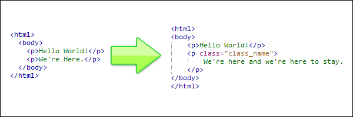
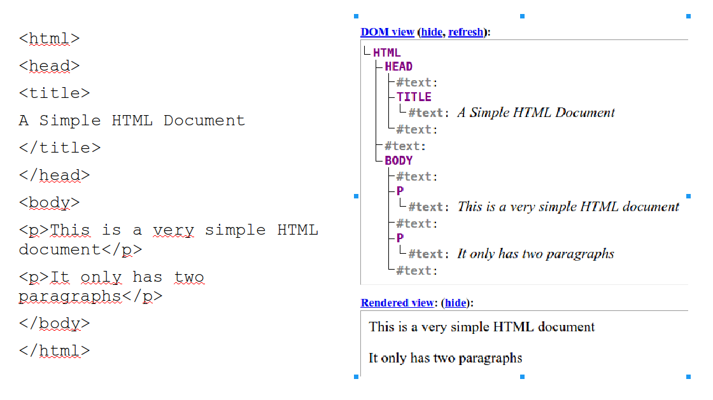

<style type="text/css">
.remark-slide-content {
    font-size: 28px;
    padding: 1em 2em 1em 2em;
}
.left-code {
  color: #777;
  width: 38%;
  height: 92%;
  float: left;
}
.right-plot {
  width: 60%;
  float: right;
  padding-left: 1%;
}
<style>
span.small {
  font-size: smaller;
}
</style>

```{r setup, include=FALSE}
options(htmltools.dir.version = FALSE, echo=TRUE,
        message=FALSE,warning=FALSE,
        fig.dim=c(4.8, 4.5), fig.retina=2, out.width="100%")

knitr::opts_chunk$set(echo = TRUE)

knitr::knit_hooks$set(mysize = function(before, options, envir) {
  if (before) 
    return(options$size)
})
```


# Outline

.columnwide[
  ### 1) [Introduction: What is _parsing_](#Introduction)
  ### 2) [Parsing HTML with `rvest``](#rvest)
  ### 3) [Using CSS selectors to locate information](#css)
  ### 4) [References and Resources](#Resources)
]

---

class: inverse, middle, center

name: Introduction

# Introduction: What is _parsing_?

---

# Introduction to parsing

- Scraping HTML pages usually done in two steps: 
    - First, desired content from the Web is examined to determine if it is actionable to further analyses.
    - Second, HTML files are read and information is extracted from them. 

- Parsing HTML occurs at both steps
    - *by the browser* to display HTML content nicely, and also  
    - *by parsers in R* to construct useful representations of HTML documents in our programming environment.

---

# What is *parsing*

Parsing involves *breaking down a text into its component parts of speech with an explanation of the form, function, and syntactic relationship of each part*. [Wikipedia](https://en.wikipedia.org/wiki/Parsing).


```{r}

```
<small>
[HTML Parsing and Screen Scraping with the Simple HTML DOM Library](https://code.tutsplus.com/tutorials/html-parsing-and-screen-scraping-with-the-simple-html-dom-library--net-11856)
</small>
---

# Reading vs parsing

- Not just a semantic difference: 
  + **reading** relies on functions that *do not care about the formal grammar that underlies HTML*, only recognizing the sequence of symbols included in the HTML file.
    
  + **parsing** employs programs that understand the special meaning of the mark-up structure reconstructing the HTML hierarchy within some R-specified structure.

---

# Getting data (1): *Reading* an HTML file

- HTML files are text files, thus, they can be read using the `readlines()` function:

```{r out.width="80%"}
url <- "http://www.r-datacollection.com/materials/html/fortunes.html"
fortunes <- readLines(con = url)
head(fortunes, n=10)
```

---

# __readLines()__ is a _reading_ function

- maps every line of the input file to a separate value in a character vector creating a flat representation of the document.

- it is *agnostic* about the different tag elements (name, attribute, values, etc.),

- it produces results that do not reflect the document’s internal hierarchy *as implied by the nested tags* in any sensible way.
    
---

# Getting data (2): parsing an HTML file

- To achieve a useful representation of HTML files, we need to employ a program that: 
    + understands the special meaning of the markup structures, and 
    + reconstructs the implied hierarchy of an HTML file within some R-specific data structure.
- This can be achieved by parser functions such as `rvest::read_html()` or `XML::htmlparse`.

---

# Parsing HTML with read_html

```{r echo=TRUE}
library(rvest)
url <- "http://www.r-datacollection.com/materials/html/fortunes.html"
myHTML<- read_html (url)
myHTML
```

---

# The Document Object Model

- The structure of the parsed HTML object can be better viewed using `xml_structure` function from the `xml2` package.

```{r eval=FALSE}
# Print the HTML excerpt with the xml_structure() function
xml2::xml_structure(myHTML)
```

- This representation is related with what we call the *Document Object Model (DOM)*.

- A Document Object Model is a _queryable data object_ that can be  built from any HTML file and is useful for further processing of document parts.

---

# A distraction: HTML tree structure

- A HTML document can be seen as a hierarchichal collection of tags which contain distinct elements.
- <span class="small">Hint: Paste the source code of the _fortunes.html_ document in [This viewer](https://software.hixie.ch/utilities/js/live-dom-viewer/)</span>

```{r, out.width="70%"}

```

---

# DOM-style parsers

- Transformation from HTML code to the DOM is the task of a *DOM-style parsers*. 
<!-- - Parsers belong to a *general class of domain-specific programs that traverse over symbol sequences and reconstruct the semantic structure of the document within a data object of the programming environment*. -->
- There are two mainstream packages that can be used for parsing HTML code
  + [rvest package](https://github.com/hadley/rvest) by Hadley Wickam,
  + [XML package](https://cran.r-project.org/web/packages/XML/index.html) by Duncan Temple and Debbie Nolan.
  
- A few others can be found at [CRAN Task View: Web Technologies and Services](https://cran.r-project.org/web/views/WebTechnologies.html).
    <!-- + See also the table and introduction at: (An R web crawler and scraper)[https://github.com/salimk/Rcrawler] -->

---

# Scrapping tools (I): The `XML` package


- The `XML` package provides an interface to `libxml2` a powerful parsing library written in C.
- The package is designed for two main purposes
    + parsing xml / html content
    + writing xml / html content (*we wonn't cover this*)

---

# What can be achieved with `XML`?

- The `XML` package is useful at 4 major types of tasks:

  1. parsing xml / html content
  2. obtaining descriptive information about parsed contents
  3. navigating the tree structure (ie *accessing its components*)
  4. querying and extracting data from parsed contents

- The `XML` package can be used for both XML and HTML parsing.

---

class: inverse, middle, center

name: rvest

# Parsing HTML with `rvest`

---

# Scraping tools: The `rvest` package

- `rvest` is an R package written by [Hadley Wickam](http://hadley.nz/) to _easily scrap web pages_
  - Wrappers around the 'xml2' and 'httr' packages to make it easy to download, and manipulate, HTML and XML
  - It is inspired in the [BeautifulSoup](https://www.crummy.com/software/BeautifulSoup/) python package.
  - It is designed to work with  [magrittr](https://github.com/tidyverse/magrittr) to simplify tasks.

- See more information on `rvest` at: 
 + [rvest package on CRAN](https://cran.r-project.org/web/packages/rvest/index.html)
 + [rvest documentation on DataCamp](https://www.rdocumentation.org/packages/rvest/versions/1.0.3)
    

---

# Basic `rvest` capabilities

- Get the data: Parse an html document from a url, a file on disk or a string containing html with `read_html()` (from the `xml2` package!).<tab>   [+info](https://www.rdocumentation.org/packages/xml2/versions/1.3.3/topics/read_xml)

- Extract elements using `html_element(s)()`.  [+info](https://www.rdocumentation.org/packages/rvest/versions/1.0.3/topics/html_element)

- Use `html_text2()` to extract the plain text contents of an HTML element. [+info](https://www.rdocumentation.org/packages/rvest/versions/1.0.3/topics/html_text2)

- Or use `html_attr(s)()` to retrieve the value of a single attribute. [+info](https://www.rdocumentation.org/packages/rvest/versions/1.0.3/topics/html_attr)

- Use `html_table` to read a table from within a page. [+info](https://www.rdocumentation.org/packages/rvest/versions/1.0.3/topics/html_table)
    
---

# More `rvest` capabilities

+ Get children from an element `html_children()`.

+ Extract, modify and submit forms with 
  -`html_form()`, `set_values()` and `submit_form()`.

+ Detect and repair encoding problems with:
  - `guess_encoding()` and `repair_encoding()`. 
  Then pass the correct encoding into `html()` as an argument.

---

# Examples (1): Read HTML

.pull-left[
```{r}
html_0 <- '
<html> 
  <body> 
    <h1>Web scraping is cool</h1>
    <p>It requires getting data and parsing it.</p>
    <p><a href="https://aspteaching.github.io/WSWRCourse">A course on Web Scraping</a> </p>
  </body> 
</html>'
```
]
.pull-right[
- HTML data can be read with `read_html`.
```{r eval=FALSE}
html_object <- xml2::read_html(html_0)
show(html_0)
```
XML structure can be better viewed with:
```{r eval=FALSE}
# Print the HTML excerpt with the xml_structure() function
xml_structure(html_0)
```
]

---
# Examples (2): html_elements()

.pull-left[
```{r}
list_of_links <- '<h3>Useful links</h3>
<ul>
  <li><a href="https://wikipedia.org">Wikipedia</a></li>
  <li><a href="https://www.ub.edu">UB</a></li>
  <li><a href="https://diba.cat">Diputació de Barcelona</a></li>
</ul>'
```
]
.pull-right[
Extract all the "a" nodes from the bulleted list.
```{r eval=FALSE}

links <- list_of_links %>% 
  read_html() %>% 
  html_elements("a")
```
]

---
# Examples (3): html_table()

.pull-left[
```{r}
sample1 <- minimal_html("<table>
  <tr><th>Col A</th><th>Col B</th></tr>
  <tr><td>1</td><td>x</td></tr>
  <tr><td>4</td><td>y</td></tr>
  <tr><td>10</td><td>z</td></tr>
</table>")
```
]
.pull-right[
```{r eval=TRUE}
sample1 %>%
  html_element("table") %>%
  html_table()
```
]

---

# Examples (3b): more `html_table()`


```{r}
url <- "https://en.wikipedia.org/wiki/List_of_World_Heritage_in_Danger"
pageTables <- read_html (url)  %>% 
  html_elements("table") %>%
  html_table() 
M2<- pageTables[[2]]
head(M2, n=3)
```

---

class: inverse, middle, center

name: css

# Using CSS selectors to locate information

---

# Improving location using css selectors

- Functions such as `html_elements` or ` html_table` return one or all the elements of a given kind.
- To decide _which objects to select_ we must identify them.
- This may be done using CSS selectors that have been used in the page to give structure ("tags") or change properties ("class", "id") of objects.
---

# Examples 4: Selection with tags


- We can select the elements of a given type letting `html_elements`know which type it is.

<div style="font-size:11pt">
.pull-left[
```{r}
  myHTMLdoc <- '<html> 
  <body> 
    <div>Python </div>
    <p> Is perfect for programming.</p>
    <p> A nicely built language </p>
    <div>R </div>
    <p>Better for data analysis.</p>
    <p>Has prettier charts, too.</p>
  </body> 
</html>'
```
]
.pull-right[
```{r}
theLanguages <- read_html(myHTMLdoc) %>%
  html_elements('div') %>%
  html_text2()
theLanguages
```

]

---

# Examples 4b: Multiple selection

- The same idea can be used to select elements that have one of several tags

<div style="font-size:11pt">
.pull-left[
```{r}
  myHTMLdoc <- '<html> 
  <body> 
    <div>Python </div>
    <p> Is perfect for programming.</p>
    <small> A nicely built language </small>
    <div>R </div>
    <p>Better for data analysis.</p>
    <small>Has prettier charts, too.</small>
  </body> 
</html>'
```
]
.pull-right[
```{r}
theLanguages <- read_html(myHTMLdoc) %>%
  html_elements('div, small') %>%
  html_text2()
theLanguages
```

]
</div>
---

# Examples 5: Selection with class/id

- After inspecting the page it can be seen that the table we are interested in is of class "wikitable"
- This is informed to `html_element` as: _type.class_

<div style="font-size:11pt">

```{r}
url <- "https://en.wikipedia.org/wiki/List_of_World_Heritage_in_Danger"
oneTable <- read_html (url)  %>% 
  html_element("table.wikitable") %>%
  html_table() 
head(oneTable, n=3)
```

---
# Combining selectors

- Selectors can be combined using operators as follows:
  `selector1 {space|>|+|~} selector2`

- There are four types of combinators
  - `space`: Descendant combinator
  - `>`: Child combinator
  - `+`: Adjacent sibling combinator
  - `~`: General sibling combinator

---

# Examples 6: Combining selectors


<div style="font-size:13pt">
.pull-left[
```{r}
myhtml<- "<html>
<body>
<div class = 'first'>
<a>A link.</a>
<p>The first paragraph with
<a>another link</a>.
</p>
</div>
<div>
Not an actual paragraph,
but with a <a href='#'>link</a>.
</div>
</body>
</html>"
```
]
.pull-right[

```{r eval=FALSE}
htmlObj<- myhtml %>% read_html()
htmlObj %>% 
  html_elements('div.first a')
htmlObj %>% 
  html_elements('div.first > a')
htmlObj %>% 
  html_elements('div.first + div')
htmlObj %>% 
  html_elements('div.first ~ div')
```

]
</div>
---

# Examples 7: Combining selectors


<div style="font-size:13pt">
.pull-left[
```{r}
myhtml<- '<html>
  <body>
    <div class="first section">
      Some text with a <a href="#">link</a>.
    </div>
    <div class="second section">
      Some text with <a href="#">another link</a>.
      <div class="first paragraph">Some text.</div>
      <div class="second paragraph">Some more text.
        <div>...</div>
      </div>
    </div>
  </body>
</html>'
```
]
.pull-right[

- Select all divs that descend from another div.
- This can be done easily:
```{r eval=FALSE}
htmlObj<- myhtml %>% read_html()
# Select the three divs with a simple selector
htmlObj %>%
	html_elements('div div')
```

- Or more complicated:

```{r eval=FALSE}
# ComplexSelect
htmlObj %>%
	html_elements('.first + .second > div, 
	              div.second.paragraph > div')
```

]
</div>
---

class: inverse, middle, center

name: Resources

# References and Resources

---

# Resources
 
