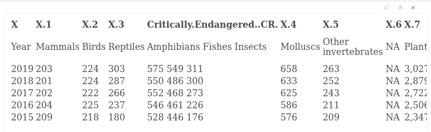
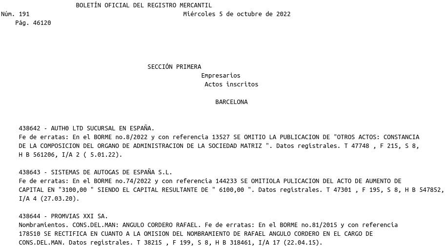

<style type="text/css">
.remark-slide-content {
    font-size: 28px;
    padding: 1em 2em 1em 2em;
}
.left-code {
  color: #777;
  width: 38%;
  height: 92%;
  float: left;
}
.right-plot {
  width: 60%;
  float: right;
  padding-left: 1%;
}
<style>
span.small {
  font-size: smaller;
}
</style>

```{r setup, include=FALSE}
options(htmltools.dir.version = FALSE, echo=TRUE,
        message=FALSE,warning=FALSE,
        fig.dim=c(4.8, 4.5), fig.retina=2, out.width="100%")

knitr::opts_chunk$set(echo = TRUE)

knitr::knit_hooks$set(mysize = function(before, options, envir) {
  if (before) 
    return(options$size)
})
```

# Outline

.columnwide[
  ### 1) [Introduction](#Introduction)
  ### 2) [Scraping PDF files](#pdf)
  ### 3) [References and Resources](#Resources)
]

---

class: inverse, middle, center

name: Introduction

# Introduction

---

# Beyond HTML

- We have learned how to scrape _static_ web pages which are developped mainly in HTML.
- While the most common, it is not the only format used in the web either
  - To develop web pages
  - To store data
- A global overview of web scraping should also consider _dynamic web pages_,
- As well of acquiring data from a bunch of distinct formats such as XML, JSON or PDF.
- In this chapter we will take a bird's eye view on how to extract data from PDF files.

---
class: inverse, middle, center

name: pdf

# Extracting information from PDF files

---
# Plenty of pdf files

- PDF is a very popular format between users.

- Although it is not exactly a format for the web,
- The web is full of pdf documents giving access to
  - Text we may wish to mine
  - Data we may want to recover

- We would like to be able to easily extract text and tables from pdf documents in a similar way as we do with HTML.

---
# The __P__ortable __D__ocument __F__ormat

- The PDF format was created bt Adobe in 1993 to facilitate _sharing_ and _printing_ documents.

- But it was not intended for being indexed or searched.

- Unlike HTML or XML, PDF files do not have an easy-to-parse structure which makes  scraping pdf more artisanal work.

---

# There are PDFs and PDFs

- The fact that there is no agreement on the internal structure a pdf file must have, makes it more complicated to extract information from it in a unique form. 

- Some files, such as pdfs created by saving a text document or "printing" a file as pdf  may have an relatively clean structure that makes them easy to parse.

- Other, such as files created by scanning text/images ("OCR") may be more complicated requiring distinct software for that goal.
  
---

# PDF conversion software

- The characteristics described above make scraping pdf files a task more complicated than one would expect.
- This has also generated the availability of multiple software solutions of distinct types and distinct prices.
  - [Top 9 Free PDF Converter in 2022](https://pdf.wondershare.com/top-pdf-software/free-pdf-converter.html)
  - [How to Extract Data From PDF Documents](https://nanonets.com/blog/extract-data-from-pdf/) (_Commertial, not endorsed!_)
- Some factors when it comes to deciding which tool to use 
  - Ease of use
  - Repeteability
  - Quantity
---

# R packages

- There are a few packages specific fot pdf files
  - **[pdftools](https://docs.ropensci.org/pdftools/)**
  - [pdftables](https://github.com/expersso/pdftables)
  - [PDF Data Extractor (PDE)](https://cran.r-project.org/web/packages/PDE)
  - **[tabulizer](https://github.com/ropensci/tabulizer)** (_Not in CRAN due to dependencies problems_)

- Also some standard packages allow reading files.

  - [textreadr](https://rdrr.io/cran/textreadr/)
    - A small collection of tools to read many file types.

---

class: inverse, middle, center

name: tabulizer

# Extracting tables with `tabulizer`

---

# Tabulizer Example

- From the package vignette

<div style="font-size:15pt">

```{r eval=FALSE}
library(tabulizer)
f <- system.file("examples", "data.pdf", package = "tabulizer")
out1 <- extract_tables(f)
str(out1)
## List of 4
##  $ : chr [1:32, 1:10] "mpg" "21.0" "21.0" "22.8" ...
##  $ : chr [1:7, 1:5] "Sepal.Length " "5.1 " "4.9 " "4.7 " ...
##  $ : chr [1:7, 1:6] "" "145 " "146 " "147 " ...
##  $ : chr [1:15, 1] "supp" "VC" "VC" "VC" ...
```

---

# A more elaborated example (1)

This has been adapted from the R-bloggers entry:  
[PDF Scraping in R with tabulizer](https://www.r-bloggers.com/2019/09/pdf-scraping-in-r-with-tabulizer/)

```{r eval=FALSE}
library(tabulizer)
library(tidyverse)
myFile <- "endangered_species.pdf"
endangered_species_scrape <- extract_tables(
    file   = myFile, 
    method = "decide", 
    output = "data.frame")
endangered_species_raw_tbl <- endangered_species_scrape %>% 
    pluck(1) %>% 
    as_tibble()
```

---
# A more elaborated example (2)

<div style="font-size:15pt">
```{r eval=FALSE}
# Show first 6 rows
endangered_species_raw_tbl %>% head() %>% knitr::kable()
```

```{r echo=FALSE}

```

Once the data has been extracted it may be (must be) further processed 
  - to clean and tidy the data
  - to visualize and analyze it

---

class: inverse, middle, center

name: pdftools

# Extracting text with pdf_tools()

---

# The `pdf_tools` package

- Imagine we need to convert a pdf file from the "BOLETÍN OFICIAL DEL REGISTRO MERCANTIL"
[https://www.boe.es/borme/dias/2022/10/05/pdfs/BORME-A-2022-191-08.pdf](https://www.boe.es/borme/dias/2022/10/05/pdfs/BORME-A-2022-191-08.pdf)

- Start downloading the file on which we are interested.

<div style="font-size:15pt">
```{r}
myURL <- "https://www.boe.es/borme/dias/2022/10/05/pdfs/BORME-A-2022-191-08.pdf"
myFilename <-"BORME-A-2022-191-08.pdf"
download.file(url=myURL, destfile=myFilename)
```

---

# Text extraction from pdf 

- PDF file is extracted as a vector of character strings
- Each string contains a peage of the document
- Once the data is available it may/must be cleaned using R text analysis capabilities

.pull-left[

```{r eval=FALSE}
library(pdftools)
txt <- pdf_text(myFilename)
class(txt)
length(txt)
cat(txt[1])
```
]

.pull-right[
```{r echo=FALSE}

```
]

---

# Getting more information

- In addition to reading in our .pdf file, we may want to extract certain metadata about it as well. 
- pdftools has a few handyu functions that can be used to extract things 
  - the number of pages: `pdf_info()`
  - the fonts being used:  `pdf_fonts()` 
  - the table of contents: `pdf_toc()`
  - whether there are any attachments: `pdf_attachments()` 
  - or the original date and time the document was created: `pdf_pagesize()` 
---

class: inverse, middle, center

name: Ressources

# References and Resources
---

# Resources 

-[PDF Scraping in R with tabulizer](https://www.r-bloggers.com/2019/09/pdf-scraping-in-r-with-tabulizer/)

-[Converting PDFs to txt files with R](https://ladal.edu.au/pdf2txt.html)
-[Getting your .pdfs into R](https://alexluscombe.ca/post/r-pdftools/)
-[Parsing your .pdfs in R](https://alexluscombe.ca/blog/parsing-your-.pdfs-in-r/)

-[https://learningactors.com/how-to-extract-and-clean-data-from-pdf-files-in-r/](https://learningactors.com/how-to-extract-and-clean-data-from-pdf-files-in-r/)
-[Scrape tables from PDF](https://crimebythenumbers.com/scrape-table.html)


